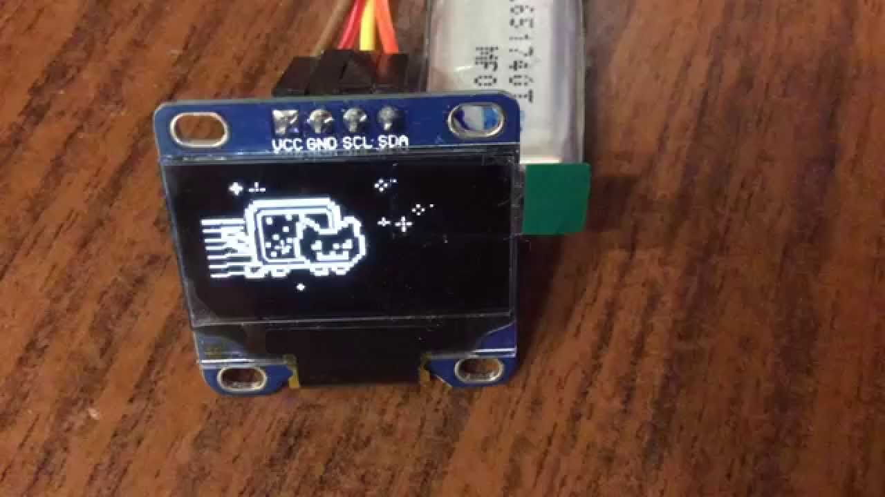

# SSD1306
Minimal SSD1306 display driver in less than 100 lines of C

### Why?
Why the feck not? Current LCD libraries like u8glib or MicroLCD are bloated with ill-written code and seemingly randomly put together hackety-hack.

These sub 100 lines of C follows the datasheet information, only setting what really needs to be set and documents why things were set. This library does not contain any high-level features like fonts or texts or drawing functions like drawEllipse and so on. It really only gives you a framebuffer which you can set pixels in. Then you transfer the entire buffer to device.

It assumes a 128x64 pixel monochrome display but you can easily modify things. If you do not have 1kb of RAM to spare for the framebuffer you can modify it to render the scene multiple times, sending parts of the scene in steps. I don't care for that, I have enough RAM in my MCU.

### MCU agnostic
Many libraries are only for Arduino and hardcoded only for it. This library only depends on I2C data trasfer and provides an I2C wrapper which can be implemented on any hardware that support the I2C bus, even on non-Arduino devices.
